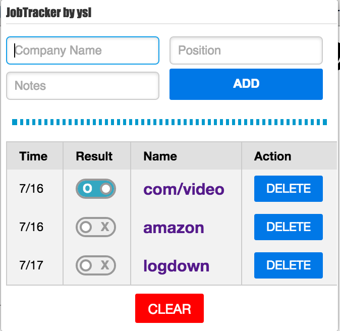

JobTracker
---
Tracking history of your job applications.

Purpose
---
As a senior student, I have been trying to get an internship. However, I always lost track the job openings and which job position I had already applied. Therefore, I made this simple Chrome extension to help myself to keep track oppertunities, applications I submitted, and some quick notes corresponding to certain web pages.

Feature
---
  * Store the URL, job title, position, personal notes for job applications.
  * Easy access and clean layout.

More
---
  * The extension can be used not only tracking job applications but also making quick notes and bookmark any web page.

Installation
---
  * Get extension from Chrome Web Store.

Main View
---

Usage
---
| ICON | Name | Usage |
|:----:| ---- | ----- |
|  | Name Field | Insert company name here |
|  | Position Field | Insert position here |
|  | Note Field | Insert notes here (max 200 characters) |
|  | Add Button | Add entry into storage |
|  | Delete Button | Delete entry |
|  | Clear Button | Clear all history |

Library
---
  * <a href="http://purecss.io/">Pure CSS 0.6.0</a>
  * <a href="https://blog.jquery.com/2015/07/13/jquery-3-0-and-jquery-compat-3-0-alpha-versions-released/">jQuery v3.0.0</a>

